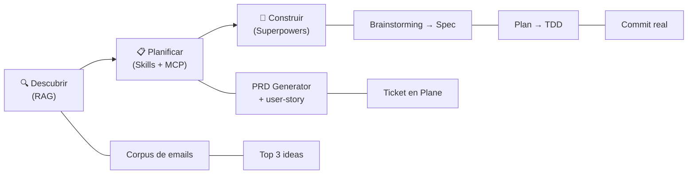

# Phase 0: Series Scaffolding - Pattern Map

**Mapped:** 2026-04-20
**Files analyzed:** 15 (12 new + 3 mutated)
**Analogs found:** 9 / 15 (6 files are truly greenfield — external references provided instead)

## Scope

Phase 0 is documentation-only. There are no Java/JSF/EJB code mutations. Analogs are drawn from the two existing Marp decks, the existing `docs/presentations/CLAUDE.md`, the repo-root `CLAUDE.md`, and the existing `docker-compose.yml` / `Dockerfile`. Where no analog exists in the repo (Mermaid primitive diagrams; sidecar templates; series-index README; QUAL-GATES reference doc), the planner should treat the file as greenfield and follow the external reference cited.

## File Classification

| New / Modified File | Role | Data Flow | Closest Analog | Match Quality |
|---------------------|------|-----------|----------------|---------------|
| `docs/presentations/README.md` | doc-index | reference (audience-facing table) | `./README.md` (repo root, minimal) + NONE for table structure | partial (structure greenfield) |
| `docs/presentations/SETUP.md` | doc (install guide) | reference | `./CLAUDE.md` (Stack + Build sections — codeblocks + bullet style) | role-match |
| `docs/presentations/THEME.md` | theme snippet / frontmatter reference | copy-paste | `docs/presentations/2026-04-10-ai-driven-development/2026-04-10-ai-driven-development.md` (frontmatter block, lines 1-10) + `docs/presentations/2026-04-08-mas-alla-del-hype/2026-04-08-mas-alla-del-hype.md` (dark variation, lines 1-10) | **exact** |
| `docs/presentations/QUAL-GATES.md` | doc (gate reference) | reference | NONE in repo (greenfield) | no analog |
| `docs/presentations/CONCERNS-MAPPING.md` | doc (master table) | reference | `.planning/codebase/CONCERNS.md` (HIGH/MED table shape — source of rows) | role-match (consumer of CONCERNS.md) |
| `docs/presentations/GLOSSARY/GLOSSARY.md` | deck (Marp source) | reference (non-linear) | `docs/presentations/2026-04-10-ai-driven-development/2026-04-10-ai-driven-development.md` (Marp deck structure + speaker-note convention) | role-match (deck shape; paginate differs) |
| `docs/presentations/GLOSSARY/GLOSSARY.html` | rendered deck | build output | `docs/presentations/2026-04-10-ai-driven-development/2026-04-10-ai-driven-development.html` (build-output parallel) | exact (same render pipeline) |
| `docs/presentations/GLOSSARY/{rag,mcp,skill,agent,hook,command}.mmd` | mermaid source | diagram | `docs/presentations/2026-04-10-ai-driven-development/2026-04-10-ai-driven-development-ciclo.mmd` | role-match (one existing `.mmd` file) |
| `docs/presentations/GLOSSARY/{rag,mcp,skill,agent,hook,command}.svg` | rendered diagram | build output | `docs/presentations/2026-04-10-ai-driven-development/2026-04-10-ai-driven-development-ciclo.svg` | exact (same render pipeline) |
| `docs/presentations/MANIFEST.template.md` | template (presenter sidecar) | fill-in form | NONE in repo (greenfield — research ARCHITECTURE.md Pattern 1 is the spec) | no analog |
| `docs/presentations/REHEARSAL.template.md` | template (presenter sidecar) | checklist + notes | NONE in repo (greenfield) | no analog |
| `docs/presentations/HANDOUT.template.md` | template (attendee handout) | fixed sections fill-in | NONE in repo (greenfield — D-02 defines sections) | no analog |
| `docker-compose.yml` (mutate) | infrastructure config | static config | self (same file, re-written in place) | self-mutation |
| `Dockerfile` (mutate) | infrastructure config | static config | self (same file, re-written in place) | self-mutation |
| `docs/presentations/CLAUDE.md` (mutate, append) | convention doc | reference | self (extends same file — keep existing Marp/Mermaid/Language sections verbatim, append four new H2 sections) | self-mutation |

## Pattern Assignments

### `docs/presentations/THEME.md` (theme snippet)

**Analog:** `docs/presentations/2026-04-10-ai-driven-development/2026-04-10-ai-driven-development.md` (light variation) + `docs/presentations/2026-04-08-mas-alla-del-hype/2026-04-08-mas-alla-del-hype.md` (dark variation).

**Frontmatter block to canonicalize** (source: `2026-04-10-ai-driven-development.md` lines 1-10, light variant):

```yaml
---
marp: true
theme: gaia
class: lead
paginate: true
backgroundColor: "#fff"
color: "#1e1e2e"
title: "AI Driven Development — De la idea al commit en una sesión"
author: "Pablo Martínez"
---
```

**Dark variation** (source: `2026-04-08-mas-alla-del-hype.md` lines 1-10):

```yaml
backgroundColor: "#1e1e2e"
color: "#cdd6f4"
```

**Pattern to replicate in THEME.md:**
- Single copy-pasteable YAML frontmatter block for every deck (D-04 decision).
- Two named variations: "light (default)" and "dark (diagrams with light lines)".
- `theme: gaia` is the convention — do not substitute custom CSS in frontmatter (research verified `theme:` key resolves theme *names*, not paths).
- `title:` and `author:` are fill-in fields; `author: "Pablo Martínez"` is the locked value from both existing decks.
- **Do NOT add `html: true`** to frontmatter — existing decks render via `--html` CLI flag (documented in `docs/presentations/CLAUDE.md` lines 21-24).

---

### `docs/presentations/GLOSSARY/GLOSSARY.md` (Marp deck)

**Analog:** `docs/presentations/2026-04-10-ai-driven-development/2026-04-10-ai-driven-development.md`.

**Frontmatter pattern** (adapt from analog lines 1-10, but override `paginate: false` per Pitfall 9):

```yaml
---
marp: true
theme: gaia
class: lead
paginate: false      # OVERRIDE — glossary is a reference, not a linear presentation
backgroundColor: "#fff"
color: "#1e1e2e"
title: "Glosario de primitivas — Serie AI-SWE 2026"
author: "Pablo Martínez"
---
```

**Per-primitive slide pattern** (structural idiom from `2026-04-10-ai-driven-development.md` "RAG en 1 slide" lines 66-80, generalized):

```markdown
# <Primitive in Spanish>

**Concepto en 1 línea:** [one-sentence definition in Spanish]

**Qué hace:**
- [bullet 1]
- [bullet 2]
- [bullet 3]


> <one-line teaching quote — the "memorable" phrase>

<!-- Slide referenced by: Sessions 1, 3, 4, 5, 6, 7, 8 -->
```

**Speaker-note convention** (from analog lines 22-27, used on every slide):

```markdown
<!--
[Spanish presenter-only text, multi-line, no trailing punctuation requirement]
-->
```

**Existing definitions that should be lifted (not copied verbatim — rephrased & shortened, but teaching point preserved):**
- **RAG** — analog lines 66-73: "Retrieval Augmented Generation: dale a Claude contexto que NO está en el código. No es fine-tuning. No es memoria infinita. Sí es: un índice (BM25 + embeddings semánticos) que devuelve los pedazos relevantes."
- **MCP** — analog lines 140-148: "Model Context Protocol — el estándar abierto para que las IA hablen con herramientas externas."
- **Skill** — analog lines 156-164: "Un skill es un manual que Claude carga a demanda. Skills > prompts largos. El skill se versiona, se comparte, se mejora."
- **Agent** — NO analog in existing decks. Draft fresh per research SUMMARY.md: "sub-agente con su propio contexto y herramientas".
- **Hook** — NO analog in existing decks. Draft fresh: "capa determinística alrededor del output estocástico del LLM" (Session 7 framing).
- **Slash Command** — NO analog in existing decks. Draft fresh: "punto de entrada disparado por el usuario que compone Skills, Agents y Hooks".

**Spanish-language flag:** All slide text Spanish. Front-matter `title` Spanish. Speaker notes Spanish. No English definitions.

---

### `docs/presentations/GLOSSARY/{rag,mcp,skill,agent,hook,command}.mmd` (6 Mermaid sources)

**Analog:** `docs/presentations/2026-04-10-ai-driven-development/2026-04-10-ai-driven-development-ciclo.mmd` (4 lines — the only `.mmd` in the repo).

**Complete analog file** (for reference):



**Pattern to replicate:**
- `graph LR` (left-to-right) is the established idiom.
- Node labels in Spanish, in double-quoted strings, with `<br/>` for two-line labels.
- Emojis at the start of major-node labels (🔍 📋 🔨 style) — optional but established.
- `-->` for causal/sequential arrows; `---` for sub-relationship (node to descriptor).
- No mermaid theme overrides in the `.mmd` source; `-b transparent` is applied at render time via the CLI (`docs/presentations/CLAUDE.md` lines 37-42).

**Per-primitive diagram** must show data + control flow per Session 1 S01-03 requirement (research PATTERNS §Primitives Glossary note 6). Decorative diagrams do not satisfy the gate. Examples of what this means per primitive (planner's guidance, not locked):
- **rag.mmd:** Query → Embedder → Vector store → Top-k chunks → LLM context → Answer.
- **mcp.mmd:** Claude → MCP client → MCP server → Tool (Plane / Postgres / etc.) → Result → Claude.
- **skill.mmd:** User prompt → Claude detects keyword → Loads SKILL.md → Follows steps → Output.
- **agent.mmd:** Parent agent → spawn → Sub-agent (own context + tools) → return summary → Parent.
- **hook.mmd:** Tool call (pre) → Hook script → allow/deny/modify → Tool executes → Tool call (post) → Hook script.
- **command.mmd:** `/command-name args` → Claude → composes Skills + Agents + Hooks → result.

**External reference if drafting from scratch:** Mermaid docs at https://mermaid.js.org/syntax/flowchart.html. `[CITED: research open question — no in-repo analog for these 6 specific diagrams]`

---

### `docs/presentations/GLOSSARY/GLOSSARY.html` + `{primitive}.svg` (rendered outputs)

**Analog:** `docs/presentations/2026-04-10-ai-driven-development/2026-04-10-ai-driven-development.html` + `.../2026-04-10-ai-driven-development-ciclo.svg`.

**Pattern to replicate (render-on-commit — from `docs/presentations/CLAUDE.md` lines 19-26, 35-44):**

```bash
# Marp render (from docs/presentations/CLAUDE.md lines 21-24)
npx @marp-team/marp-cli@latest --html \
  docs/presentations/GLOSSARY/GLOSSARY.md \
  -o docs/presentations/GLOSSARY/GLOSSARY.html

# Mermaid render (from docs/presentations/CLAUDE.md lines 37-42)
npx @mermaid-js/mermaid-cli \
  -i docs/presentations/GLOSSARY/rag.mmd \
  -o docs/presentations/GLOSSARY/rag.svg \
  -b transparent
```

**Commit both `.mmd` + `.svg` together**, and both `.md` + `.html` together, per `docs/presentations/CLAUDE.md` line 27 ("Always regenerate and commit the `.html` alongside `.md` changes") and line 44 ("Commit both `.mmd` and `.svg`").

---

### `docs/presentations/CLAUDE.md` (mutate — append sections)

**Analog:** self. The file is 57 lines as of 2026-04-19 and already has four H2 sections: `## Folder structure`, `## Marp build`, `## Diagrams (Mermaid)`, `## Language`. **Do not rewrite these.**

**Existing H2 headings that must remain anchored in place** (for downstream doc links):

```markdown
# Presentations
## Folder structure
## Marp build
## Diagrams (Mermaid)
### Workflow
### Why pre-rendered SVG
## Language
```

**New sections to append** (per SCAF-04 + research CLAUDE.md Extension Strategy §432-491):

```markdown
## Convención de numeración NN-<slug>
## Sidecar per sesión
## Git tags: session-NN-pre / session-NN-post
## Fallback artifact (QUAL-02)
## QUAL gates
```

**Bilingual convention** (derived from the existing file which mixes Spanish rule with English heading "Folder structure"): new headings may be Spanish (matches "Convención", "Sesión", "Fallback artifact"); inline code blocks stay English/bash; prose in the existing ratio.

**Link pattern** (new content must link to `../QUAL-GATES.md`): `Ver \`../QUAL-GATES.md\`` — sibling relative path since both live at `docs/presentations/` root.

---

### `docker-compose.yml` (mutate — SCAF-05 pin)

**Analog:** self. File is 40 lines (see above Read). Mutation preserves entire structure: `services.db`, `services.app`, `volumes`, healthcheck, env, ports, depends_on — all unchanged.

**Mutation surface (exactly 1 line — line 3):**

```yaml
# BEFORE
  db:
    image: postgres:15

# AFTER (per research §Docker Tag Pinning, digest verified 2026-04-20)
  db:
    image: postgres:15.17-bookworm@sha256:ea647d76ba6059d92926662900af0f5d4bcaa9adcb1de477a32f80db3f14b9fe
    # Pinned 2026-04-20. Update cadence: monthly. See docs/presentations/SETUP.md §"Cadencia de actualización".
```

**Constraints (from research):**
- **Do NOT re-format the rest of the file.** Only the `image:` line + a comment below it change.
- **Do NOT change the service name `db` or `app`.** `./dev-sync.sh` depends on these.
- **Do NOT add `platform: linux/amd64`** even though the cited digest is amd64-specific. Per research Open Question 3, planner should re-fetch via `docker buildx imagetools inspect postgres:15.17-bookworm --format '{{json .Manifest}}' | jq -r .digest` to get the multi-arch manifest-list digest, and substitute that in place of the amd64-only digest.
- **Preserve the env-var default syntax** `${POSTGRES_PASSWORD:-dotachile}` (line 6) — this is a DotaChile convention (repeated on line 25 for the app service).

---

### `Dockerfile` (mutate — SCAF-05 pin)

**Analog:** self. 2 `FROM` lines (lines 2 and 13).

**Mutation surface (exactly 2 lines):**

```dockerfile
# BEFORE — line 2
FROM maven:3.8-openjdk-11 AS build

# AFTER (per research §Docker Tag Pinning — digest must be fetched by planner)
FROM maven:3.8.8-openjdk-11@sha256:<fetched-at-pin-time> AS build
# Pinned 2026-04-20. Verified tag maven:3.8.8-openjdk-11 (concrete patch). Update cadence: monthly.

# BEFORE — line 13
FROM payara/server-full:5.2022.5

# AFTER (digest verified 2026-04-20)
FROM payara/server-full:5.2022.5@sha256:95f45ebc141eb68f1e572725b570aad03059a4e8ab34e590f8f7c7259011df75
# Payara 5 EOL — 5.2022.5 is the last release on the 5.x line. Do NOT upgrade to Payara 6.
```

**Constraints:**
- The Maven build stage digest **must be fetched at plan-execution time** (research flagged this was NOT verified in the research session). Command: `docker manifest inspect maven:3.8.8-openjdk-11 | jq -r '.manifests[] | select(.platform.architecture=="amd64") | .digest'` or the multi-arch equivalent.
- All other lines (COPY, RUN, ENV, HEALTHCHECK) are unchanged.
- Preserve the stage alias `AS build` and the `COPY --from=build` reference on line 17 and line 33.
- Document the Payara 5 EOL inline (per research Pitfall 8) to preempt future "just update it" temptation.

---

### `docs/presentations/MANIFEST.template.md` (template — greenfield)

**Analog:** NONE in repo.

**External reference** (per research §Sidecar Templates MANIFEST.template.md): `.planning/research/ARCHITECTURE.md` Pattern 1 Example lines 114-145 is the structural template.

**Pattern to replicate (from research §Sidecar Templates + D-01 placeholder-annotated skeleton rule):**

```markdown
# [Replace: Session NN — Título en español]

**Fecha:** [Replace: YYYY-MM-DD]
**Presentador:** Pablo Martínez

## Tags

- **Pre:** `session-NN-pre` → SHA `[Replace: git rev-parse session-NN-pre]`
- **Post:** `session-NN-post` → SHA `[Replace: fill post-session only]`
- **Compare:** https://github.com/[Replace: org]/dotachile/compare/session-NN-pre...session-NN-post

## Slide → Commit map

| # | Slide | Commit SHA | Notas |
|---|-------|------------|-------|
| 1 | [Replace: slide title] | `[Replace: SHA]` | [Replace: notas] |
| 2 | [Replace: slide title] | `[Replace: SHA]` | [Replace: notas] |

## Recovery command

\`\`\`bash
git reset --hard session-NN-pre
docker compose restart app
\`\`\`

## Versions (QUAL-12)

| Componente | Versión | Cuándo |
|------------|---------|--------|
| Claude Code CLI | `[Replace: claude --version]` | rehearsal + delivery |
| Model ID | `[Replace: e.g., claude-opus-4-7]` | rehearsal + delivery |
| Ollama | `[Replace: ollama --version]` | rehearsal + delivery |
| Marp CLI | `[Replace: npx @marp-team/marp-cli@4.3.1]` | rehearsal + delivery |
| Mermaid CLI | `[Replace: @mermaid-js/mermaid-cli@11.12.0]` | rehearsal + delivery |
| MCP servers | `[Replace: nombres y versiones]` | rehearsal + delivery |

## Known follow-ups

- [Replace: issue link or "ninguno"]

<!-- see QUAL-GATES.md §QUAL-01, §QUAL-12 -->
```

**Constraints (per D-01 + research Pitfall 3):**
- **No fake example rows.** Every field uses `[Replace: ...]` inline prompt.
- **Mark pre- vs post-session fields** (pre-SHA fillable at planning time; post-SHA + compare URL + slide-to-commit map filled after the live session).
- **Reference (do not duplicate) QUAL gate text.** The footer `<!-- see QUAL-GATES.md §QUAL-01, §QUAL-12 -->` is the only mention.

---

### `docs/presentations/REHEARSAL.template.md` (template — greenfield)

**Analog:** NONE in repo.

**Pattern to replicate (per D-03 + research §Sidecar Templates):**

```markdown
# [Replace: Session NN] — Rehearsal log

**Fecha del rehearsal:** [Replace: YYYY-MM-DD, mismo día de la sesión]
**Fecha de la sesión:** [Replace: YYYY-MM-DD]

## Checklist (QUAL-02, QUAL-03, QUAL-09, QUAL-12)

- [ ] Model ID pinned — see MANIFEST.md → QUAL-12
- [ ] Fallback artifact (asciinema `.cast` o VHS `.tape`) existe junto al deck — QUAL-02
- [ ] Switchover live → fallback ensayado una vez — QUAL-02
- [ ] Fecha de rehearsal registrada (mismo día) — QUAL-03
- [ ] Plan de red: WiFi del venue probado O hotspot listo — Pitfall 1
- [ ] Payara + Postgres pre-warm `docker compose up -d` + request de calentamiento, ≥10 min antes — QUAL-09
- [ ] `.html` del deck renderiza limpio (HTMLPreview-compatible)
- [ ] Todos los `.mmd` tienen `.svg` pre-renderizado

<!-- see QUAL-GATES.md §QUAL-02, §QUAL-03, §QUAL-09 -->

## Notas libres

### Timing por sección

- [Replace: sección → minutos observados]

### Cortes

- [Replace: qué se sacó y por qué]

### Flakes / correcciones manuales

- [Replace: observaciones para "Lo que la IA NO hizo" — QUAL-04]
```

**Constraints (per D-03 + research Pitfall 3):**
- **Checklist uses `- [ ]` syntax, not a table.** Grep-based verification (`grep -c '^- \[x\]'`) must work.
- **Free-form notes section below the checklist** — no structured headings required beyond the three shown.
- **Gate references by ID only** (`see QUAL-GATES.md §QUAL-02`), no duplicated gate text.

---

### `docs/presentations/HANDOUT.template.md` (template — greenfield)

**Analog:** NONE in repo.

**Pattern to replicate (per D-02 + research §Sidecar Templates HANDOUT.template.md §540-575, verbatim the research-provided block):**

```markdown
# [Replace: Session NN — Título]

**Fecha:** [Replace: YYYY-MM-DD]
**Deck:** [Replace: link to deck .html]

## ¿Qué vimos?

- [Replace: bullet 1]
- [Replace: bullet 2]
- [Replace: bullet 3]

## Comandos para probar

\`\`\`bash
[Replace: comandos que la audiencia puede correr post-sesión]
\`\`\`

## Link de comparación

- Pre → Post: https://github.com/[Replace: org/repo]/compare/session-NN-pre...session-NN-post

## Próxima sesión

- [Replace: session NN+1 — slug + fecha + 1-liner]
- Prereqs adicionales: [Replace: or "ninguno más allá de SETUP.md"]

## Lecturas

- [Replace: link 1]
- [Replace: link 2]

<!-- see QUAL-GATES.md §QUAL-06 for bilingual-convention note -->
```

**Constraints (per D-02):**
- **Five fixed Spanish section headers** — `¿Qué vimos?`, `Comandos para probar`, `Link de comparación`, `Próxima sesión`, `Lecturas`. Do not rename.
- **No generic sample bullets** (explicitly rejected per D-02). Every list item is a placeholder.
- **Spanish throughout.** Code-block content may be bash/English; prose is Spanish.

---

### `docs/presentations/QUAL-GATES.md` (reference doc — greenfield)

**Analog:** NONE in repo.

**External reference:** `.planning/REQUIREMENTS.md §QUAL` (QUAL-01..12) + research §Sidecar Templates §QUAL-GATES.md structure.

**Pattern to replicate:**

```markdown
# QUAL Gates — Reference

Las 12 reglas que cada sesión del arco 2026 debe cumplir. Esta doc es la única fuente.
Los templates (MANIFEST/HANDOUT/REHEARSAL) linkean por ID, no duplican.

## QUAL-01 — MANIFEST.md completo

**Qué exige:** [una frase]
**Por qué existe:** [un párrafo corto]
**Cómo se verifica:** [grep/script/check]
**Template asociado:** `MANIFEST.template.md`

## QUAL-02 — Fallback artifact + switchover rehearsed
...

## QUAL-12 — Version pins en MANIFEST
```

**Constraints:**
- **12 H2 sections, one per gate, ordered QUAL-01 → QUAL-12.** IDs greppable.
- **Spanish prose; English section anchors are OK** per mixed convention of existing `docs/presentations/CLAUDE.md`.
- **Every paragraph names which template(s) enforce it** (MANIFEST / REHEARSAL / HANDOUT). Cross-reference without duplication.

---

### `docs/presentations/CONCERNS-MAPPING.md` (master table — partial analog)

**Analog:** `.planning/codebase/CONCERNS.md` — provides the HIGH/MED rows that feed this file. CONCERNS-MAPPING.md is the *transform* of CONCERNS.md into session claims.

**Table pattern (per D-05 + research §CONCERNS → Session Mapping §239-257):**

```markdown
# CONCERNS → Session mapping

Fuente: `.planning/codebase/CONCERNS.md`. Esta doc es autoritativa para claims de demo-task.

## Demo-Task Bank — HIGH/MED Claims

| Severity | CONCERNS section/ID | Slice ID | Claimed by | Status | Notes |
|----------|---------------------|----------|------------|--------|-------|
| HIGH | Security §XSS | XSS-01 | Session 8 | claimed | `/dota-audit-xss` |
| HIGH | Security §XSS | XSS-02 | Session 8 | claimed | |
| HIGH | Security §XSS | XSS-03 | Session 8 | claimed | |
| HIGH | Security §XSS | XSS-04 | Session 8 | claimed | |
| HIGH | Security §XSS | XSS-05 | Session 8 | candidate | Alt: Session 5 Skill demo |
| HIGH | Security §PvpgnHash | PVPGN-PREP | Session 5 or 6 | candidate | Dual-hash columns |
| HIGH | Security §PvpgnHash | PVPGN-ROLLOVER | deferred or Session 6 | candidate | Mid-migration |
| HIGH | Security §PvpgnHash | PVPGN-FINALIZE | deferred (v2) | deferred | Multi-week op |
| MED | Tech debt §TorneoService | TORNEO-GODCLASS | Session 6 | claimed | Agents subagent target |
| HIGH | Performance §N+1 | TORNEO-N1 | Session 5 or 6 | candidate | 1-2 commit slice |
| MED | Fragile §Docker pins | DOCKER-PINS | Phase 0 | claimed | Satisfied by SCAF-05 |

## Deferred / Out-of-Scope

| Slice ID | Reason | Revisit |
|----------|--------|---------|
| EOL-STACK | Structural; not session-sized | v2 arc |
| PVPGN-FINALIZE | Multi-week operational | v2 |
| FILES-TRAVERSAL | Multi-hour audit | v2 |
| CSRF-ABSENT | Config + audit, not session-sized | v2 |
| FORM-AUTH-TLS | Ops concern | v2 |
| SCHED-BATCH | Multi-file, low urgency | v2 |
| SCHED-CONTENTION | Operational | v2 |
| DEV-SYNC-FRAGILE | Hardening not demo | v2 |
| TODOS-SWEEP | Grep fodder, not primary | v2 |
| ENTITY-EQUALS | Teaching topic, not session-sized | v2 |
```

**Constraints (per D-05, D-06, D-07, D-08, Pitfall 7):**
- **Slice-level IDs, not whole-concern IDs.** XSS-01..XSS-05, PVPGN-PREP / PVPGN-ROLLOVER / PVPGN-FINALIZE, TORNEO-GODCLASS / TORNEO-N1 — stable, greppable.
- **Single master table** (no second doc). Deferred items live in the same file under `## Deferred / Out-of-Scope`.
- **Unidirectional link.** CONCERNS-MAPPING.md is authoritative; `.planning/ROADMAP.md` forward-links to it; this doc does NOT back-reference ROADMAP phase sections.
- **Do NOT over-lock.** Only claims tightly coupled to per-session REQs (XSS-01..04 to Session 8, TORNEO-GODCLASS to Session 6, DOCKER-PINS to Phase 0) are `claimed`. Everything else is `candidate` or `deferred`.

---

### `docs/presentations/SETUP.md` (install guide — partial analog)

**Analog:** `./CLAUDE.md` (repo root) — uses the same "Stack + Build & deploy" structure with fenced code blocks + inline comments that SETUP.md will expand.

**Excerpt from root CLAUDE.md** (lines 1-16) — structural pattern to replicate at higher fidelity in SETUP.md:

```markdown
# DotaChile

## Stack

Java 8, JSF 2 + PrimeFaces 4, EJB Stateless/Singleton, JPA 2 (EclipseLink),
Maven WAR (`DotaCL.war`), Payara 5 in Docker, PostgreSQL 15.

## Build & deploy

\`\`\`
mvn -o package                      # offline build → target/DotaCL.war
docker compose up -d --build        # full image rebuild + start
./dev-sync.sh java                  # compile + push classes → triggers redeploy
./dev-sync.sh views                 # push XHTML/CSS/images → instant, no redeploy
./dev-sync.sh all                   # java then views
\`\`\`
```

**SETUP.md pattern** (per Claude's Discretion default + research §SETUP.md End-to-End §329-416):

- **Two-layer structure.** Quick-start code-block up top (3 lines for senior readers); "Apéndice" below for full setup.
- **Spanish prose.** English inline code comments OK (matches the root CLAUDE.md mixed convention).
- **Tool pins from research Tool inventory table** (Marp `4.3.1`, Mermaid `11.12.0`, Node `≥20`, Python `3.11+`).
- **Reuse build commands verbatim** from root CLAUDE.md: `docker compose up -d --build`, `./dev-sync.sh java|views|all`, `mvn -o package`.
- **Three-platform install commands** (`brew` / `apt` / `winget` or `choco`) per Pitfall 6 — avoid macOS-only dead-ends.
- **Payara 5 EOL note** inline per Pitfall 8.
- **email-rag corpus** section pointing to `tools/email-rag/README.md` + noting per-developer build (matches root CLAUDE.md lines 55-76 conventions).

---

### `docs/presentations/README.md` (series index — greenfield)

**Analog:** NONE in repo (the root `./README.md` is 6 lines and does not match the table shape).

**External reference:** Research §SCAF-01 table schema — "columns: #, date, slug, status, abstract, folder link, pre/post tags".

**Pattern to replicate (per Claude's Discretion default + research Validation §SCAF-01 grep pattern):**

```markdown
# Serie AI-SWE 2026 — DotaChile

Workshop de desarrollo asistido por IA sobre la codebase legacy de DotaChile.
9 sesiones, 1 hora cada una, todo en `master`, demos reales con commits reviewables.

Pre-requisitos: ver [`SETUP.md`](SETUP.md).

## Sesiones

| # | Fecha | Slug | Estado | Abstract | Folder | Tags |
|---|-------|------|--------|----------|--------|------|
| 01 | [Replace: YYYY-MM-DD] | [Replace: slug] | pending | [Replace: 1-line abstract] | [Replace: ./YYYY-MM-DD-01-<slug>/](./placeholder/) | session-01-pre / session-01-post |
| 02 | [Replace] | [Replace] | pending | [Replace] | [Replace] | session-02-pre / session-02-post |
| ... (through 09) |
```

**Constraints (per Claude's Discretion default + Pitfall 4):**
- **Spanish audience-facing.** `#`, `Fecha`, `Slug`, `Estado`, `Abstract`, `Folder`, `Tags` (matches research validation grep-patterns: `grep -q "Próxima\|Sesión\|Fecha\|Estado"`).
- **Status column values: `pending | rehearsed | delivered`** (per research validation pattern — `grep -E "(pending|rehearsed|delivered)"`).
- **Zero-padded NN** in row numbers (`01`..`09`) — matches `docs/presentations/CLAUDE.md` extension convention (NN-infix).
- **Exactly 9 session rows** (research validation: `grep -c "^\| 0[1-9] " ... -eq 9`).
- **Manual sync with session folders** — deferred automation per CONTEXT "Deferred Ideas". Planner accepts this cost.

---

## Shared Patterns

### Render-on-commit convention

**Source:** `docs/presentations/CLAUDE.md` lines 19-26 (Marp build) + lines 35-44 (Mermaid workflow).

**Apply to:** GLOSSARY.md → GLOSSARY.html; every `.mmd` → `.svg`.

```bash
# Marp — always regenerate .html alongside .md
npx @marp-team/marp-cli@latest --html <file>.md -o <file>.html

# Mermaid — always regenerate .svg alongside .mmd
npx @mermaid-js/mermaid-cli -i <name>.mmd -o <name>.svg -b transparent
```

**Rule:** commit both source + rendered output in the same commit.

### Speaker notes convention

**Source:** `docs/presentations/2026-04-10-ai-driven-development/2026-04-10-ai-driven-development.md` (used on every slide — e.g. lines 22-27, 38-43, 107-111).

**Apply to:** GLOSSARY.md (every slide); also guidance surfaces in `docs/presentations/CLAUDE.md` extension under the NN-infix convention section.

```markdown
<!--
[Spanish presenter text, multi-line]
[Can include stage directions like ALT-TAB AL TERMINAL]
-->
```

**Rule:** HTML comments survive marp-cli render, invisible to the audience.

### Spanish-language rule (flag)

**Source:** `./CLAUDE.md` lines 51-53 ("Always keep package, class, entity, view, and database names in Spanish. Do not propose English renames.") + `docs/presentations/CLAUDE.md` lines 54-57 ("All presentation content is in Spanish per the project's Spanish-language rule").

**Apply to:** ALL user-facing deliverables in Phase 0:
- `README.md` — Spanish (audience-facing index).
- `SETUP.md` — Spanish prose, English code.
- `THEME.md` — English OK (presenter tooling reference); but `title` placeholder + examples Spanish.
- `QUAL-GATES.md` — Spanish prose, English IDs.
- `CONCERNS-MAPPING.md` — Mixed OK (follows `.planning/codebase/CONCERNS.md` convention).
- `GLOSSARY.md` + all `.mmd` labels — Spanish.
- `MANIFEST.template.md` — Spanish placeholders + section headers; English git commands.
- `REHEARSAL.template.md` — Spanish section headers + checklist; English gate IDs.
- `HANDOUT.template.md` — Spanish section headers (the 5 D-02 fixed sections are locked Spanish).
- `docs/presentations/CLAUDE.md` extension — Mixed (matches existing file).

**Flagged analogs that would produce English-only output if copied verbatim:**
- `./CLAUDE.md` (root) — Mostly English prose. SETUP.md must **re-author in Spanish**, not copy.
- `docs/presentations/CLAUDE.md` (existing file) — Mixed Spanish/English. When extending, match the existing mixed ratio. Do **not** mass-translate existing content to Spanish — it will break doc cross-references.
- Research `.planning/research/*.md` files — English. Phase 0 deliverables must **transform** research content into Spanish, not copy.

### Placeholder-annotation convention (templates)

**Source:** D-01 rule + research §Sidecar Templates — no existing repo analog (greenfield convention).

**Apply to:** MANIFEST.template.md, REHEARSAL.template.md, HANDOUT.template.md.

**Form:** `[Replace: <what-goes-here>]` inline prompt next to every fillable field. No fake example rows. Token `[Replace:` should be greppable to verify presenters filled everything in.

**Verification pattern** (for session plan-phase acceptance):

```bash
# After filling in templates per session, verify no residual placeholders
grep -c "\[Replace:" docs/presentations/YYYY-MM-DD-NN-<slug>/MANIFEST.md
# Expected: 0 at delivery time; >0 at pre-session time is OK for post-fields
```

### QUAL gate cross-reference convention

**Source:** D-04 rule + research Pitfall 3.

**Apply to:** All three templates + CLAUDE.md extension.

**Form:** `<!-- see QUAL-GATES.md §QUAL-NN -->` HTML comment or inline `see \`QUAL-GATES.md §QUAL-NN\``. Templates **never** duplicate gate text; they link by ID.

**Verification pattern:**

```bash
# Gate text is single-source
grep -l "fallback artifact" docs/presentations/*.template.md
# Expected: empty — gate text only in QUAL-GATES.md
```

### Session-folder naming convention (NN-infix)

**Source:** CLAUDE.md extension (SCAF-04) is the canonical place; also surfaced in README.md table rows.

**Form:** `docs/presentations/YYYY-MM-DD-NN-<slug>/` where `NN` is `01`..`09`. Pre-series decks (`2026-04-08-mas-alla-del-hype`, `2026-04-10-ai-driven-development`) intentionally lack NN — they are "raw material, not part of the arc".

**Apply to:** README.md rows (folder links), CLAUDE.md extension prose, CONCERNS-MAPPING.md claim references.

### Reference-only glossary embed (CURR-03 drift prevention)

**Source:** D-10 + research Pitfall 1.

**Apply to:** Every session deck authored in Phases 1–9 (not Phase 0 content itself, but Phase 0's CLAUDE.md extension must document the rule for session authors).

**Form in a session deck:**

```markdown


> Ver `GLOSSARY.html §RAG` para la definición completa.
```

**Never** paste the glossary text into the session deck. Text lives once (in `GLOSSARY.md`); diagrams live once (in `{primitive}.svg`); sessions reference by relative path.

---

## No Analog Found — Greenfield Files

Files with no in-repo pattern; planner must use the cited external reference as the structural template.

| File | Role | External Reference | Rationale |
|------|------|-------------------|-----------|
| `MANIFEST.template.md` | template | `.planning/research/ARCHITECTURE.md` Pattern 1 Example | First sidecar in the repo |
| `REHEARSAL.template.md` | template | `.planning/phases/00-series-scaffolding/00-RESEARCH.md` §Sidecar Templates §518-537 | First sidecar in the repo |
| `HANDOUT.template.md` | template | research §Sidecar Templates §540-575 (verbatim block) | First sidecar in the repo |
| `QUAL-GATES.md` | reference doc | `.planning/REQUIREMENTS.md §QUAL` | First gate doc in the repo |
| `docs/presentations/README.md` | series index | Research §SCAF-01 schema | Existing root README is 6 lines, structurally unrelated |
| `GLOSSARY/{primitive}.mmd` (6 diagrams) | mermaid | Mermaid docs https://mermaid.js.org/syntax/flowchart.html + single in-repo analog (`-ciclo.mmd`) for idiom | The 6 primitive-specific flows do not exist; `-ciclo.mmd` shows the graph idiom only |

For all other Phase 0 files, the analogs cited in `## Pattern Assignments` are sufficient.

---

## Metadata

**Analog search scope:**
- `docs/presentations/` (2 existing decks, 1 CLAUDE.md, 0 READMEs, 0 templates)
- `./CLAUDE.md` (root) — stack & Spanish rule
- `./README.md` (root) — minimal, not a structural match
- `docker-compose.yml`, `Dockerfile` (self-mutation targets)
- `.planning/codebase/CONCERNS.md` (CONCERNS-MAPPING source)
- `.planning/research/ARCHITECTURE.md` (sidecar + tag conventions)

**Files scanned:** 8 in-repo analogs read; 4 decisively confirmed as greenfield (templates, QUAL-GATES, README, primitive `.mmd`'s).

**Key excerpt files (line ranges used):**
- `docs/presentations/2026-04-10-ai-driven-development/2026-04-10-ai-driven-development.md` lines 1-10 (frontmatter), 22-27 + 107-111 (speaker notes), 66-80 (RAG definition), 140-148 (MCP), 156-164 (Skills)
- `docs/presentations/2026-04-08-mas-alla-del-hype/2026-04-08-mas-alla-del-hype.md` lines 1-10 (dark-frontmatter variation)
- `docs/presentations/2026-04-10-ai-driven-development/2026-04-10-ai-driven-development-ciclo.mmd` (full file — only `.mmd` in repo)
- `docs/presentations/CLAUDE.md` lines 19-26 (Marp render), 35-44 (Mermaid workflow), 54-57 (Spanish rule)
- `./CLAUDE.md` lines 1-16 (Stack + Build), 51-53 (Spanish rule), 55-76 (email-rag)
- `docker-compose.yml` full file (40 lines)
- `Dockerfile` full file (36 lines)

**Pattern extraction date:** 2026-04-20
