<!-- _class: lead -->

# Glosario de primitivas
## Serie AI-SWE 2026 — DotaChile

Seis primitivas, una slide canónica cada una.

Esta doc es **referencia**. Las sesiones la embeben con ``
y linkean con `Ver GLOSSARY.html §<Primitive>` — nunca copian el texto (CURR-03).

<!--
Presentador: slide de entrada. Nadie presenta este deck completo en vivo —
sirve como HTML de referencia que carga en una tab durante las sesiones.
Las definiciones están en español; los IDs (RAG, MCP, etc.) se quedan en inglés
porque son términos de arte estables del ecosistema Claude Code.
-->

---

# RAG

**Concepto en 1 línea:** Retrieval Augmented Generation — darle a Claude contexto que NO está en el código, vía búsqueda híbrida (léxica + semántica) sobre un corpus externo.

**Qué hace:**
- Indexa un corpus (emails, docs, tickets, etc.) con BM25 + embeddings semánticos
- Recibe una query; devuelve los top-k chunks más relevantes
- Inyecta esos chunks al contexto de Claude antes de que responda
- Claude solo ve los pedazos recuperados, no el corpus completo

> RAG no es fine-tuning ni memoria infinita — es búsqueda inteligente + un LLM que sabe leer los resultados.

<!--
Presentador: RAG se confunde con fine-tuning o con "IA con memoria infinita".
Ninguna de las dos. RAG = búsqueda + inyección al contexto. El ejemplo
vivo del arco es tools/email-rag/search.py (Session 3).
Slide referenciado por: Sessions 1, 3 (primary), 4, 5, 6.
-->

---

# MCP

**Concepto en 1 línea:** Model Context Protocol — el estándar abierto para que las IA invoquen **herramientas externas** (APIs, DBs, file systems) como si fueran funciones.

**Qué hace:**
- Un servidor MCP expone "tools" (ej. `postgres_query`, `plane_create_ticket`)
- Claude los llama con JSON estructurado; el servidor los ejecuta; devuelve el resultado
- El resultado vuelve al contexto de Claude como input para su siguiente paso
- Spec abierto — hay decenas de servidores MCP comunitarios

> Sin MCP, Claude dice "abre Plane y crea un ticket". Con MCP, lo crea él.

<!--
Presentador: MCP es el "cómo" de las acciones. Si RAG es "darle a Claude
conocimiento", MCP es "darle a Claude manos". Session 4 wirea un servidor
MCP local (SQLite o Postgres contra DotaChile) y muestra el JSON crudo del
tool-call en la terminal.
Slide referenciado por: Sessions 1, 4 (primary), 5, 6, 8, 9.
-->

---

# Skill

**Concepto en 1 línea:** Un manual versionado que Claude **carga a demanda** cuando detecta un trigger, sin inflar el system prompt inicial.

**Qué hace:**
- Vive como `SKILL.md` en `.claude/skills/` con frontmatter (description, allowed-tools)
- Claude detecta keyword en el prompt del usuario → carga el Skill en contexto
- El Skill contiene los pasos, las convenciones, los comandos del caso de uso
- Se versiona, se comparte entre devs, se compone con otros Skills

> Skills > prompts largos. Un prompt de 200 líneas se empaqueta como Skill y se invoca.

<!--
Presentador: Skill = "conocimiento bajo demanda". Ataca directo el problema
del context window (Session 2): si cargas todo upfront, te quedas sin tokens;
si cargas nada, Claude inventa. Skills cargan lo justo, cuando se necesita.
Slide referenciado por: Sessions 1, 5 (primary), 6, 8, 9.
-->

---

# Agent

**Concepto en 1 línea:** Un **subagente** con su propio contexto y herramientas, spawneado desde el agente padre vía Task tool, que ejecuta una tarea delimitada y devuelve solo el resumen.

**Qué hace:**
- El padre invoca `Task(prompt, tools)` — crea un subagente aislado
- El subagente tiene su propia ventana de contexto (no ve el contexto del padre)
- Ejecuta su tarea (lee archivos, corre búsquedas, genera un reporte)
- Al terminar, el padre recibe **solo el return value** — no el contexto intermedio

> Agents refrescan contexto — el padre no se inunda con los 1800 LOC que el subagente leyó.

<!--
Presentador: Agents = el mecanismo de "contexto desechable". Es la respuesta
arquitectónica al context-window problem de Session 2. Session 6 lo demo
contra TorneoService.java (1800 LOC god-class): el subagente lee el archivo
entero, devuelve un reporte de 10 TODOs, y el padre nunca ve los 1800 LOC.
Slide referenciado por: Sessions 1, 2 (framing), 6 (primary), 8, 9.
-->

---

# Hook

**Concepto en 1 línea:** Una **capa determinística** que corre código ordinario (scripts, CLIs) antes o después de cada tool-call de Claude, permitiendo validar, bloquear, o aumentar la acción.

**Qué hace:**
- Configurado en `.claude/settings.json` — matcher por tool (Edit, Write, Bash, etc.)
- `PreToolUse` corre antes: exit code no-cero bloquea la llamada
- `PostToolUse` corre después: puede correr validaciones (tests, linters, compilers)
- Claude ve el output del hook como feedback y puede auto-corregirse

> Hooks = capa determinística alrededor del output estocástico del LLM.

<!--
Presentador: Hooks son la contraparte determinística a la naturaleza
estocástica del LLM. Session 7 demos un PostToolUse que corre mvn -o compile
en cada edit de Java, y un PreToolUse que bloquea escrituras en
src/java/controller/ (ver CLAUDE.md: off-limits folder).
Slide referenciado por: Sessions 1, 2 (framing — determinismo), 7 (primary), 8, 9.
-->

---

# Slash Command

**Concepto en 1 línea:** Un **punto de entrada disparado por el usuario** (`/nombre-comando args`) que compone Skills, Agents, Hooks y MCPs en un flujo nombrado y reproducible.

**Qué hace:**
- Vive como `.md` en `.claude/commands/` con frontmatter (description, argument-hint, allowed-tools)
- Usuario tipea `/mi-comando arg1 arg2` en la CLI
- Claude carga el comando → compone los pasos (invocar Skills, spawnear Agents, llamar MCP tools)
- Es el "entry point nombrado" — Skills son invocados por keyword, Commands por invocación explícita

> Command = user-triggered entry point. Skill = loaded behavior on demand. Resuelve la ambigüedad de Session 5.

<!--
Presentador: Commands vs Skills genera confusión en la audiencia después
de Session 5. La diferencia clave: el USUARIO invoca Commands
(/mi-comando); Claude invoca Skills automáticamente al detectar el trigger.
Session 8 autorea /dota-audit-xss en vivo y compone con Skills + Agents.
Slide referenciado por: Sessions 1, 5 (contrast), 8 (primary), 9.
-->

---

## Referencias

- `SKILL.md` anatomy: docs.claude.com/en/docs/claude-code/skills
- MCP spec: modelcontextprotocol.io
- Hooks event catalog: docs.claude.com (re-verificar cada sesión — catalog drifted)
- Agents (Task tool): docs.claude.com

<!--
Presentador: slide de cierre. Las refs son para audiencia que quiera
profundizar post-sesión. HANDOUT.md de cada sesión linkea aquí.
-->
